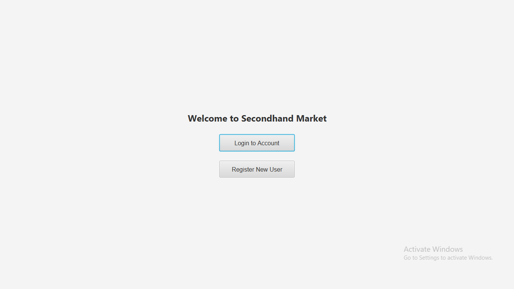
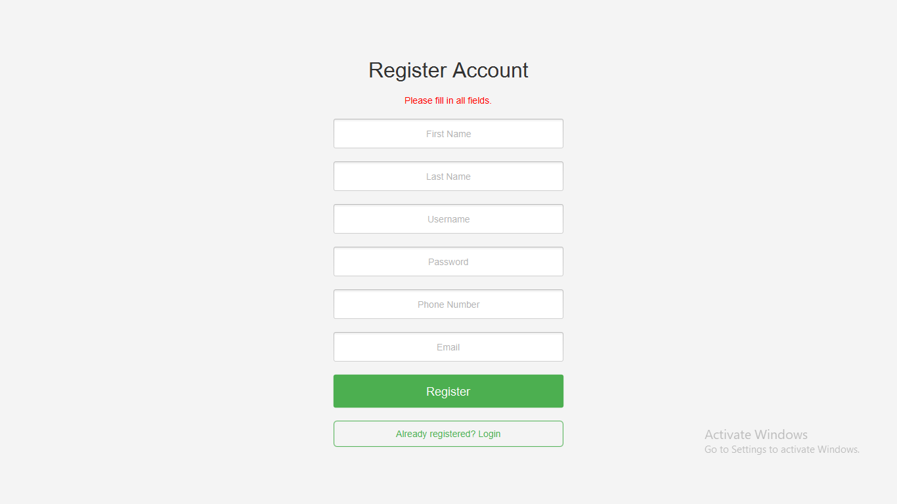
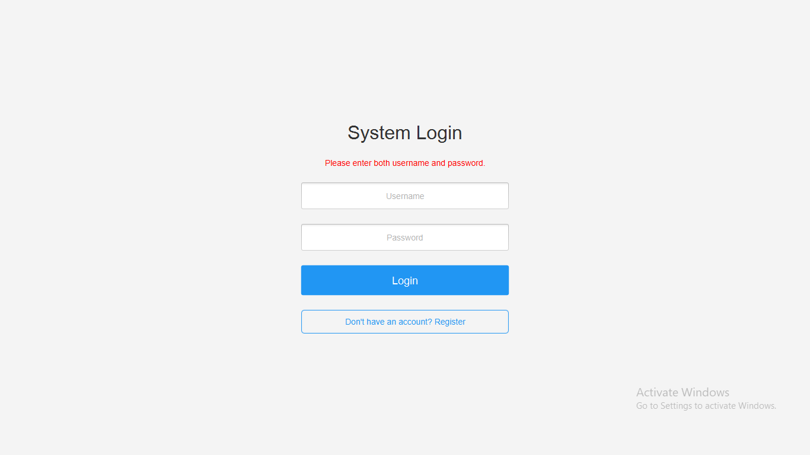
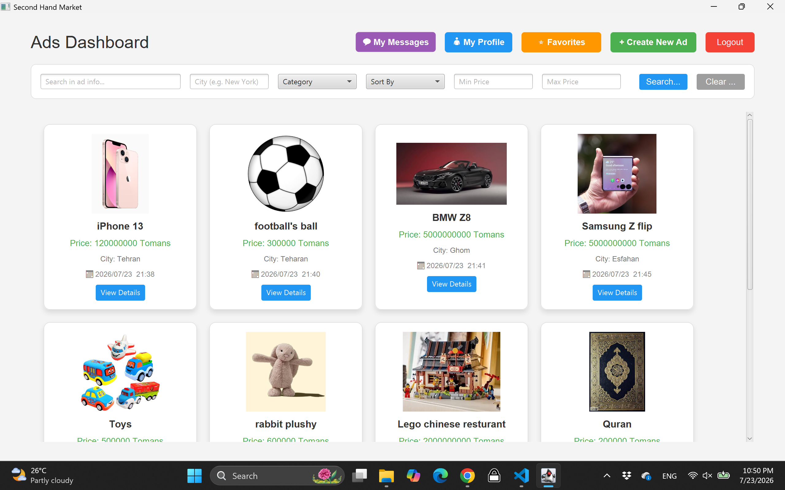
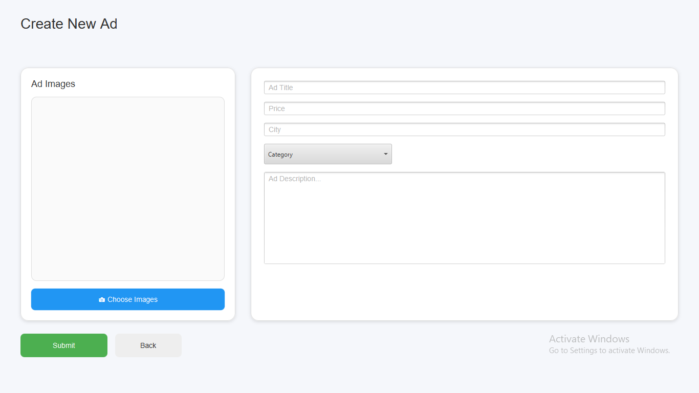
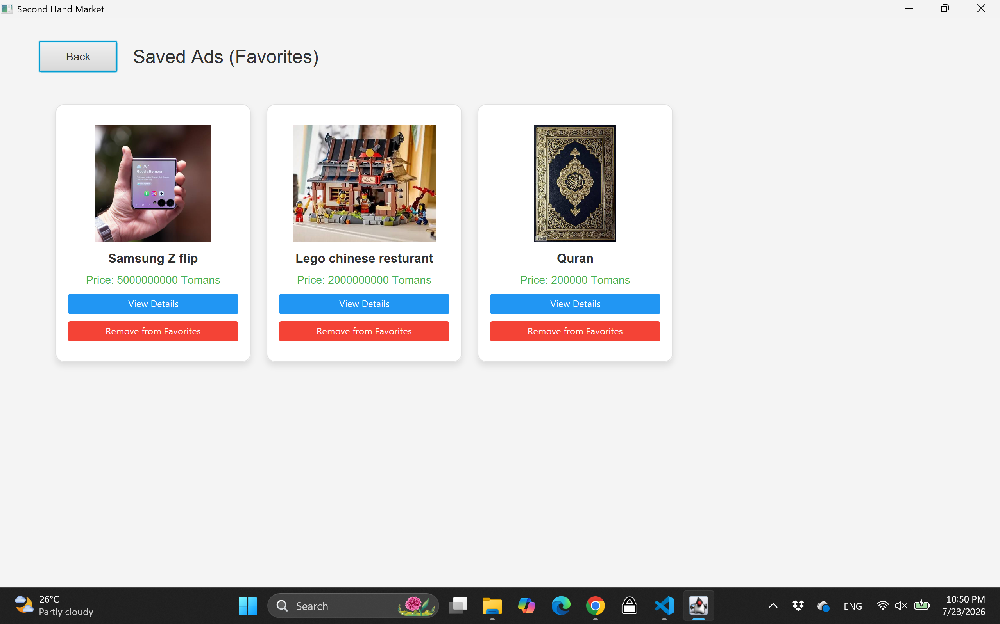
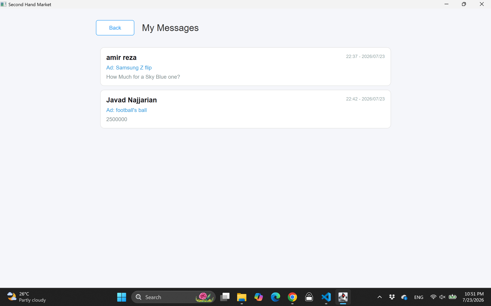
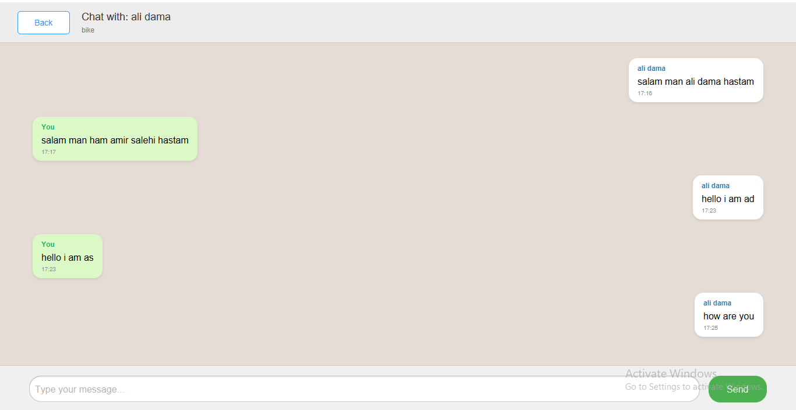

# 🛒 Secondhand Market Project

<!-- 
بخش اول: معرفی پروژه و نام هر دو عضو گروه 
-->
## 1. 👥 Project Introduction & Team Members
This project is a comprehensive application for buying and selling secondhand goods. Users can post advertisements, chat with sellers in real-time, rate ads, and leave comments. It also includes a fully-featured Admin Panel for reviewing pending ads and managing users.

**Team Members:**
1. MohammadMehdi Vahed - 40431060
2. Javad Najjarian - 40431064

---

<!-- 
بخش دوم: توضیح پیش‌نیازها و نحوه اجرای Backend 
-->
## 2. ⚙️ Prerequisites & Backend Execution
To run the backend server, you will need the following installed on your system:
* **Java:** Version 17 and above
* **Database:** MySQL
* **Maven:** For dependency management

**Execution Steps:**
1. Navigate to the `backend` directory.
2. Open the `application.properties` file and configure your database connection settings (username, password, and database URL).
3. Open your terminal in the backend folder and run the following command to build and start the server:
   ```bash
   mvn spring-boot:run

<!-- 
بخش سوم: توضیح نحوه اجرای Frontend (۱ امتیاز) 
-->
## 3. 💻 Frontend Execution
The frontend of this application is developed using **JavaFX**.

**Execution Steps:**
1. Ensure the backend server is already up and running.
2. Navigate to the `frontend` directory.
3. Open your terminal in the frontend folder and run the application using Maven:
   ```bash
   mvn javafx:run

## 4. 🗄️ Data Storage Method & Test Accounts
**Storage Method:**
* **Database:** All relational data (users, advertisements, chat messages, comments, etc.) is stored persistently using a MySQL database. 
* **Media:** Uploaded images for advertisements are stored [e.g., locally in a designated `uploads` folder on the server / as Base64 strings in the database].

**Test Accounts (For Evaluation):**
You can use the following pre-configured accounts to evaluate different roles in the system:

* **Admin Account (For Admin Panel access):**
  * Username: `Manager`
  * Password: `1234`

* **Normal User 1:**
  * Username: `J.N`
  * Password: `jn`

* **Normal User 2:**
  * Username: `Amir.Z`
  * Password: `123456`
 
* **Normal User 3:**
  * Username: `Bro`
  * Password: `123456`

* **Normal User 4:**
  * Username: `mm.Vahed`
  * Password: `mahdi`

### 📸 Screenshots
*(Note: Images are located in the `screenshots` folder)*


**1. Main Page:**


**2. Register Page:**


**3. Login Page:**


**4. Dashboard & Ads List:**


**5. Create Ad:**


**6. Ad Details 1:**


**7. Ad Details 2:**


**8. Favorits Ads 2:**


**9. Chat List page:**


**10. Live Chat Room:**


**11. Admin Panel (Manage Ads):**
.png)

**12. Admin Panel (Manage Users):**
.png)

---

## 5. ✨ Implemented Features & Screenshots
The following core features have been fully implemented:
* **Authentication:** User registration, login, and secure session management.
* **User Dashboard:** Browse, filter, and view detailed pages of approved advertisements.
* **Ad Management:** Users can post new ads with images (requires Admin approval to become active).
* **Interactive Communication:** Real-time chat system between buyers and sellers.
* **Feedback System:** Users can leave comments and submit a 1-to-5 star rating on ads.
* **Admin Panel:** A dedicated portal for administrators to approve/reject pending ads, delete ads, and manage user accounts (block/unblock/delete).

پروژه ساخت سامانه‌ی آگهی متشکل از بخش‌های Frontend و backend و همچنین اتصال به Database

اعضای گروه: جواد نجاریان، محمد مهدی واحد

برای استفاده از backend و ساختار خودش (جدا از database) از maven استفاده شده که در خودش قابلیت‌هایی مانند استفاده از JWT را می داد و همچنین از قابلیت Spring Boot برای بالا آوردن سایت و backend استفاده می شود تا خودش به طور خودکار thread سازی کرده به ازای هر کسی که بهش وصل میشه و نیاز نباشه جدا این کار را انجام دهیم
برای بالا اوردن backend اول با کمک از هوش مصنوعی ساختار پایه فایل‌ها رو (فولدرها) ایجاد کردیم و بعد هر کدام را پر کردیم
در پوشه controller هندلینگ ورودی‌های HTTM را داریم که ورودی را دریافت کرده کدش را بر اساس متغیر ها و چیز های خواسته شده به service مورد نظر اطلاعات را می دهد تا هندل کند
در پوشه services تمام قسمت اصلی پردازش‌های دستورات هست که با توجه به پیام ارسالی خروجی مورد نیاز را می دهد تا به front ارسال شود
در پوشه DTO قالب‌های درخواست و جواب وجود داره که بین backend و frontedn یکسان هست و باعث می شود نحوه‌ی ارسال و پاسخ جواب‌ها یکی باشد و در مورد نحوه‌ی آن به خطا نخوریم
همچنین برای اینکه همیشه یک جواب داشته باشیم و در خطا نیز حتی به مشکلی نخوریم و خروجی بگیره front یک APIResponse یکسان و مشترک بین هر دو هست و تمام جواب‌های فرستاده شده از backend به frontend در این قالب هست و حتما پاسخی همراه دارد
در config نکات امنیتیت و بلاک کردن از جمله دسترسی نداشتن به پنل‌ها (غیر register و login) قرار دارد و چند تا نکته امنیتی برای admin که جز اون نتونه httm های ادمین رو ارسال کنند و کاربر مسدود شده نتونه پیامی بگیره
توی security فایل‌های مربوط به JWT قرار دارد و نحوه‌ی ساخت و پردازش آنها
در Entity تمام شیء‌های داخل پروژه هستش که از انها استفاده شده است در ساخت و طراحی پروژه
فایل uplodes برای عکس ها است که سامانه پس از ثبت اگهی به backend ارسال کرده او در uplods ذخیره می کند و در نتیجه با دادن یک ادرس http راحت به عکس بدون نیاز به لود کردن دسترسی پیدا می کند
برای database از MySQL استفاده شده است (MySQL Server 8.x) و در آن اطلاعات ذخیره می شود و هندلینگ آن و ساخت آن توسط فایل‌های داخل فولدر repository هندل می شود از جمله سرچ
یک فایل در specification وجود دارد که برای فیلتر سازی استفاده می شود
همچنین فولدر exception برای هندلینگ تمام خطا ها ساخته شده است تا اگر خطایی بود که به طور دستی در کد تا هندلش نکرده بودیم بگیره و به ما در همون قالب APIResponse می فرسته تا backend هیچ وقت خطا نخوره و متوقف بشه
برای فیلترینگ از قابلیت‌های repository MySQL استفاده شده است و به طور خودکار خودش هندل می کند
ارتباط با MYSQL برای تغییر خارجی اطلاعات فقط با داشتن password امکان دارد و امنیت داره

در Frontend با داشتن DTO ها و تغییر کم Entityها از طرف backend و ذخیره آنها به ترتیب در دو فولدر dto و model دسترسی به قالب جواب‌های backend داریم
با تنظیم controller و دادن بالا آوردن سایت به آن و همچنین هندلینگ گرافیکی با resourcses در قالب fxml داریم صفحه‌های سایت بالا می آید و اطلاعات را وارد می کنیم
همچنین بعد از ورودی گرفتن در قالب های داشته در dto به services مثل backend ارسال کرده تا response مورد نظر را بگیرد و به ما بدهد و مسئول فرستادن ان هست
از APIClient به طور گسترده در تمام ServerAPI ها استفاده می شود تا لازم نباشد هر بار یک کد یکسان نوشته شود و خودش مسئول هندلینگ فورمت ورودی و خروجی ها می شود و با تعریف متغیر آزاد T در آن و دادن type جوابی که انتظار داریم از back بگیریم خودش برای ما تبدیل می کند و بهمان می دهد نتیجه را
با استفاده از Rest API و HTTM ارتباط بین backend و frontend را برقرار می کنیم تا بهم پیام دهند
داشتن چند تا front هم زمان باعث مشکل نیست چون spring boot خودش این را مدیریت می کند و با داشتن jwt ورودی ها چک می شود

قابلیت‌های برنامه شامل:
لاگین یا رجیستر، ثبت/ادیت/حذف آگهی، اپلود چندین عکس برای اگهی، دیدن تمام آگهی‌ها و جزئیات، علاقه‌مندی و امتیاز دادن و کامنت گذاشتن، چت کردن با مالک آگهی و صفحه‌ی تمام چت‌های داشته، صفحه علاقه‌مندی ها، فیلترهای چند تایی و ترتیب بندی، پنل مدیریت برای قبول/رد/حذف آگهی و مسدود یا عدم مسدود و حذف کاربر 