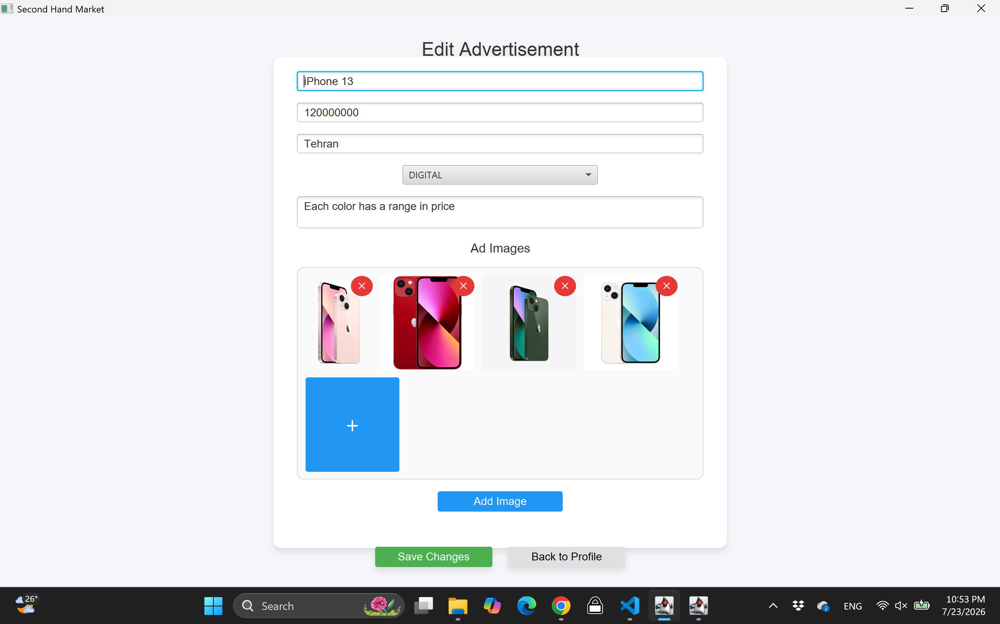
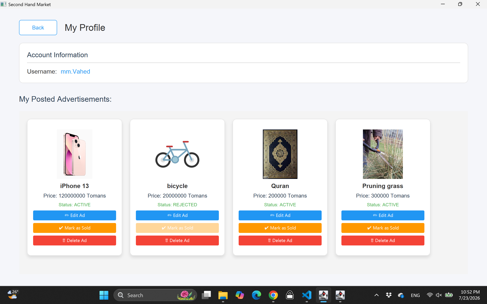

# 🛒 Secondhand Market Project

<!-- 
بخش اول: معرفی پروژه و نام هر دو عضو گروه 
-->
## 1. 👥 Project Introduction & Team Members
This project is a comprehensive application for buying and selling secondhand goods. Users can post advertisements, chat with sellers in real-time, rate ads, and leave comments. It also includes a fully-featured Admin Panel for reviewing pending ads and managing users.

**Team Members:**
1. MohammadMehdi Vahed - 40431060
2. Javad Najjarian - 40431064

---

<!-- 
بخش دوم: توضیح پیش‌نیازها و نحوه اجرای Backend 
-->
## 2. ⚙️ Prerequisites & Backend Execution
To run the backend server, you will need the following installed on your system:
* **Java:** Version 17 and above
* **Database:** MySQL
* **Maven:** For dependency management

**Execution Steps:**
1. Navigate to the `backend` directory.
2. Open the `application.properties` file and configure your database connection settings (username, password, and database URL).
3. Open your terminal in the backend folder and run the following command to build and start the server:
   ```bash
   mvn spring-boot:run

<!-- 
بخش سوم: توضیح نحوه اجرای Frontend (۱ امتیاز) 
-->
## 3. 💻 Frontend Execution
The frontend of this application is developed using **JavaFX**.

**Execution Steps:**
1. Ensure the backend server is already up and running.
2. Navigate to the `frontend` directory.
3. Open your terminal in the frontend folder and run the application using Maven:
   ```bash
   mvn javafx:run

## 4. 🗄️ Data Storage Method & Test Accounts
**Storage Method:**
* **Database:** All relational data (users, advertisements, chat messages, comments, etc.) is stored persistently using a MySQL database. 
* **Media:** Uploaded images for advertisements are stored [e.g., locally in a designated `uploads` folder on the server / as Base64 strings in the database].

**Test Accounts (For Evaluation):**
You can use the following pre-configured accounts to evaluate different roles in the system:

* **Admin Account (For Admin Panel access):**
  * Username: `Manager`
  * Password: `1234`

* **Normal User 1:**
  * Username: `J.N`
  * Password: `jn`

* **Normal User 2:**
  * Username: `Amir.Z`
  * Password: `123456`
 
* **Normal User 3:**
  * Username: `Bro`
  * Password: `123456`

* **Normal User 4:**
  * Username: `mm.Vahed`
  * Password: `mahdi`

### 📸 Screenshots
*(Note: Images are located in the `screenshots` folder)*


**1. Main Page:**


**2. Register Page:**


**3. Login Page:**


**4. Dashboard & Ads List:**


**5. Create Ad:**


**6. Ad Details 1:**
.png)

**7. Ad Details 2:**
.png)

**8. Ad Details 3:**
.png)

**9. Favorits Ads:**


**10. Chat List page:**


**11. Live Chat Room 1:**
.png)

**12. Live Chat Room 2:**
.png)

**13. Admin Panel (Manage Ads):**
-(4).png)

**14. Admin Panel (Manage Ads):**
-(3).png)

**15. Admin Panel (Manage Ads):**
-(2).png)

**16. Admin Panel (Manage Ads):**
-(1).png)

**17. Admin Panel (Manage Users):**
.png)

**18. Edit ad:**


**19. Profile:**


---

## 5. ✨ Implemented Features & Screenshots
The following core features have been fully implemented:
* **Authentication:** User registration, login, and secure session management.
* **User Dashboard:** Browse, filter, and view detailed pages of approved advertisements.
* **Ad Management:** Users can post new ads with images (requires Admin approval to become active).
* **Interactive Communication:** Real-time chat system between buyers and sellers.
* **Feedback System:** Users can leave comments and submit a 1-to-5 star rating on ads.
* **Admin Panel:** A dedicated portal for administrators to approve/reject pending ads, delete ads, and manage user accounts (block/unblock/delete).

پروژه ساخت سامانه‌ی آگهی متشکل از بخش‌های Frontend و backend و همچنین اتصال به Database

برای پیاده‌سازی Backend و ساختار کلی آن (مستقل از پایگاه داده)، از Maven استفاده شده است. Maven امکانات متعددی از جمله مدیریت وابستگی‌ها و استفاده از JWT را فراهم می‌کند. همچنین از Spring Boot برای راه‌اندازی سایت و Backend استفاده شده است. Spring Boot به‌صورت خودکار برای هر درخواست ورودی یک Thread مناسب مدیریت می‌کند؛ بنابراین نیازی به پیاده‌سازی دستی مدیریت Threadها وجود ندارد.

برای پیاده‌سازی Backend، ابتدا با کمک هوش مصنوعی ساختار اولیه پروژه و پوشه‌ها ایجاد شد و سپس هر بخش به‌صورت جداگانه تکمیل گردید.

در پوشه Controller، درخواست‌های HTTP دریافت و مدیریت می‌شوند. این بخش پس از دریافت درخواست، اطلاعات موردنیاز را بر اساس پارامترهای ورودی به سرویس مربوطه ارسال می‌کند تا پردازش شوند.

در پوشه Services، منطق اصلی برنامه و پردازش درخواست‌ها قرار دارد. این بخش با توجه به پیام دریافتی، عملیات لازم را انجام داده و نتیجه را برای ارسال به Frontend آماده می‌کند.

در پوشه DTO، قالب‌های درخواست (Request) و پاسخ (Response) قرار دارند که بین Backend و Frontend مشترک هستند. استفاده از این قالب‌ها باعث می‌شود ساختار ارسال و دریافت داده‌ها در هر دو بخش یکسان بوده و از بروز خطاهای ناشی از تفاوت قالب داده‌ها جلوگیری شود.

همچنین برای یکپارچه‌سازی پاسخ‌ها، یک کلاس مشترک به نام APIResponse تعریف شده است. تمامی پاسخ‌های ارسال‌شده از Backend به Frontend، چه در حالت موفقیت و چه در زمان بروز خطا، در همین قالب ارسال می‌شوند تا Frontend همیشه ساختار ثابتی از پاسخ را دریافت کند.

در پوشه Config، تنظیمات امنیتی پروژه قرار دارد؛ از جمله محدود کردن دسترسی به صفحات محافظت‌شده (به‌جز صفحات Login و Register)، اعمال محدودیت برای درخواست‌های مدیریتی و جلوگیری از دسترسی کاربران عادی به APIهای مخصوص مدیر. همچنین در این بخش، دسترسی کاربران مسدودشده نیز کنترل می‌شود.

در پوشه Security، فایل‌های مربوط به JWT، نحوه تولید، اعتبارسنجی و پردازش توکن‌ها قرار دارند.

در پوشه Entity، تمامی موجودیت‌های پروژه که برای ارتباط با پایگاه داده استفاده می‌شوند، تعریف شده‌اند.

پوشه Uploads برای ذخیره تصاویر آگهی‌ها در نظر گرفته شده است. پس از ثبت آگهی، تصاویر به Backend ارسال شده و در این پوشه ذخیره می‌شوند. در نتیجه، با ارائه آدرس HTTP مربوط به هر تصویر، بدون نیاز به بارگذاری مجدد در پایگاه داده، امکان دسترسی مستقیم به آن وجود دارد.

برای پایگاه داده از MySQL Server 8.x استفاده شده است. اطلاعات برنامه در این پایگاه داده ذخیره می‌شوند و عملیات مربوط به آن توسط کلاس‌های موجود در پوشه Repository مدیریت می‌شود. همچنین برای پیاده‌سازی جستجو و فیلترهای پویا، از فایل Specification استفاده شده است.

پوشه Exception نیز برای مدیریت یکپارچه خطاها ایجاد شده است. در صورتی که خطایی در بخش‌های مختلف برنامه رخ دهد و به‌صورت مستقیم مدیریت نشده باشد، این بخش آن را دریافت کرده و در قالب استاندارد APIResponse به Frontend ارسال می‌کند. به این ترتیب، Backend از توقف ناگهانی جلوگیری کرده و همواره پاسخ مناسبی به کاربر ارائه می‌دهد.

برای پیاده‌سازی فیلترها نیز از قابلیت‌های Repository در Spring Data JPA استفاده شده است که عملیات فیلترسازی را به‌صورت خودکار مدیریت می‌کند. همچنین ارتباط با پایگاه داده MySQL تنها با داشتن اطلاعات احراز هویت، از جمله رمز عبور، امکان‌پذیر بوده و از نظر امنیتی محافظت می‌شود.

در بخش Frontend، با استفاده از DTOهای مشترک و اعمال تغییرات جزئی در Entityهای دریافتی از Backend، داده‌ها در دو پوشه DTO و Model ذخیره می‌شوند. به این ترتیب، قالب پاسخ‌های Backend به‌صورت کامل در Frontend نیز در دسترس خواهد بود.

برای راه‌اندازی رابط کاربری از JavaFX استفاده شده است. کنترل صفحات توسط Controllerها انجام می‌شود و طراحی رابط گرافیکی نیز در فایل‌های FXML موجود در پوشه Resources انجام شده است. پس از دریافت اطلاعات از کاربر، داده‌ها در قالب DTO به بخش Services ارسال شده و سپس درخواست‌های لازم به Backend فرستاده می‌شوند تا پاسخ مناسب دریافت شود.

در بخش ارتباط با Backend، از کلاس APIClient به‌صورت گسترده در تمامی کلاس‌های ServerAPI استفاده شده است تا از تکرار کد جلوگیری شود. این کلاس مسئول ارسال درخواست‌ها، دریافت پاسخ‌ها و تبدیل خودکار داده‌ها است. همچنین با استفاده از Generic Type (T) و تعیین نوع پاسخ مورد انتظار، تبدیل پاسخ دریافتی از Backend به شیء موردنظر به‌صورت خودکار انجام می‌شود.

ارتباط بین Frontend و Backend از طریق REST API و پروتکل HTTP برقرار می‌شود. وجود چندین Frontend که به‌صورت هم‌زمان به سیستم متصل باشند، مشکلی ایجاد نمی‌کند؛ زیرا Spring Boot مدیریت درخواست‌های هم‌زمان را بر عهده دارد. همچنین تمامی درخواست‌ها با استفاده از JWT اعتبارسنجی می‌شوند تا فقط کاربران مجاز به بخش‌های محافظت‌شده دسترسی داشته باشند.

قابلیت‌های برنامه عبارت‌اند از:
- ثبت‌نام و ورود کاربران (Register/Login)
- ثبت، ویرایش و حذف آگهی
- بارگذاری چندین تصویر برای هر آگهی
- مشاهده تمامی آگهی‌ها و جزئیات آن‌ها
- ثبت علاقه‌مندی، امتیازدهی و ارسال نظر برای آگهی‌ها
- گفت‌وگو (Chat) با مالک آگهی و مشاهده فهرست تمامی گفتگوها
- صفحه علاقه‌مندی‌ها
- فیلترهای ترکیبی و مرتب‌سازی نتایج
- پنل مدیریت برای تأیید، رد یا حذف آگهی‌ها و همچنین مسدودسازی، رفع مسدودی یا حذف کاربران

تقسیم وظایف اعضای تیم:

محمدمهدی واحد
Backend و Database

- طراحی و پیاده‌سازی ساختار اصلی Backend.
- پیاده‌سازی بخش‌های Controller، Service، Security، Entity و Config.
- طراحی ارتباط بین بخش‌های مختلف Backend و نحوه تعامل آن‌ها با Frontend.
- پیاده‌سازی جزئیات کدنویسی و منطق هر بخش.
- طراحی و ایجاد پایگاه داده (Database)، ذخیره‌سازی اطلاعات و پیاده‌سازی عملیات جستجو و مدیریت داده‌ها.
- طراحی و پیاده‌سازی ساختار ذخیره‌سازی و نگهداری تصاویر.
- طراحی و پیاده‌سازی DTOها در هر دو بخش Backend و Frontend.

جواد نجاریان
Frontend
- طراحی ساختار صفحات سایت.
- پیاده‌سازی رابط کاربری با استفاده از فایل‌های FXML.
- طراحی ساختار اولیه APIها و برقراری ارتباط با Backend.
- پیاده‌سازی ساختار Controllerها.
- طراحی بخش Utility و بهینه‌سازی ارتباطات سیستم.
- اتصال و مدیریت جابه‌جایی بین صفحات.
- ساده‌سازی منطق اجرای دستورات (Commandها) و انتقال آن‌ها به Controllerها برای کاهش پیچیدگی کد.
- طراحی چارچوب ظاهری صفحات.
- پیاده‌سازی زیرساخت اولیه بارگذاری (Upload) تصاویر.
- اصلاح ساختار پاسخ‌های دریافتی از Backend، بهینه‌سازی APIها و طراحی Modelهای موردنیاز.
